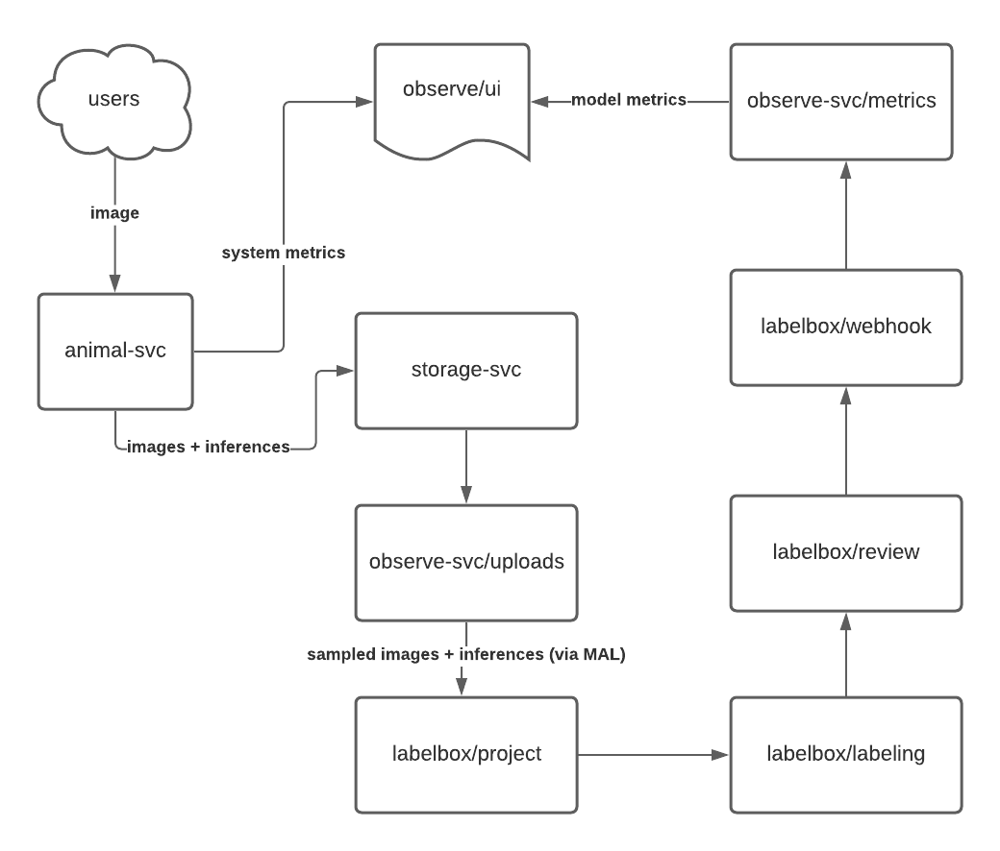
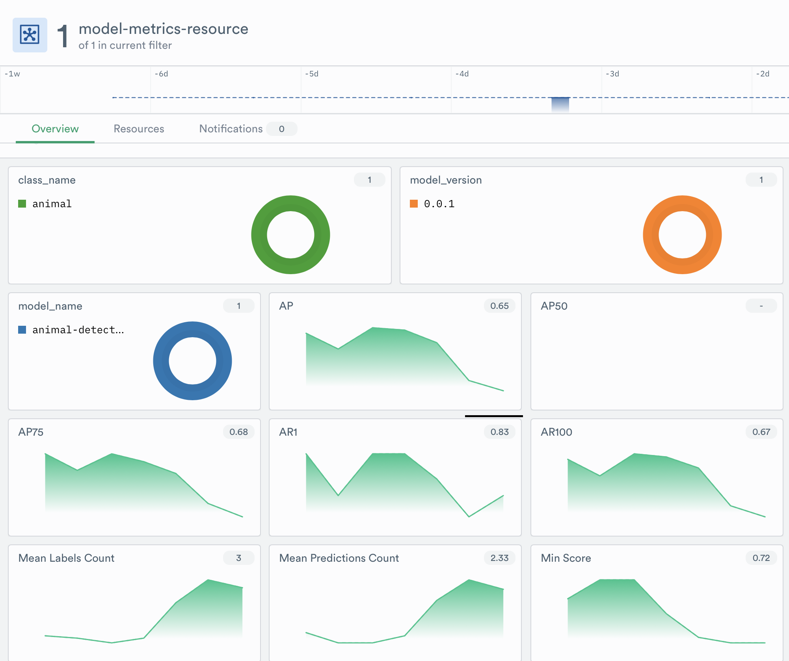

# model-observability
Track model performance over time using Observe

|  |  | 
| -------------------------------------------------------------------------------------------------------------------- | --------------------------------------------------------------------------------------------------------- |

  
## Overview
* This project demonstrates how to do the following:
    1. Train a neural network using data from labelbox
    2. Deploy the trained model
    3. Monitor the model performance over time using Labelbox and Observe
  
## Components
1. Training Code
    - Use this to create a trained model
2. inference-svc
    - Service for predicting animal bounding boxes in images
3. Oberserve-svc
    - Uploads model inferences to labelbox
    - Once inferences are labeled it computes metrics and logs them so observe can injest performance statistics
4. Storage
    - Local deployment of s3 emulator so that infrences, labels, and user requests can be persisted
5. Deployment
    - Contains all of the configuration for the minikube deployment

## Usage:

### Train
1. Train a model
    * Run the ETL: `make etl`
        * This requires that you have access to a project with a class called animal and some associated labels
        * Update etl.py to use your project id
    * Train the model `make train`
    * Create a servable `make export`
    * The model artifacts are written to the `/tmp` dir by default.    

### Deployment
1. If you have never run before run the following:
    * `make configure-labelbox`
        - Creates a new labelbox config. This is where the model feedback will be sent to (see services/observe-svc/project_conf.json)
    * `make configure-storage`
        - Creates the local storage directory structure under `./storage`
2. Deploy to minikube
    * Must have the following env vars set:
        - `LABELBOX_API_KEY` : Labelbox api key (https://docs.labelbox.com/en/introduction/faq#how-do-i-create-an-api-key-)
        - `NGROK_TOKEN` : Enables labelbox webhooks to make requests to deployments without public ip addresses (https://ngrok.com)
        - `OBSERVE_CUSTOMER_ID` and `OBSERVE_TOKEN` used to aggregate both machine and model metrics (https://www.observeinc.com)
    * `make deploy`
        - Runs the services.

### Client

* To produce metrics we can us the code in the `client` directory
* This simulates customer usage. 
    * Customers can post images of animals and the model will predict where the animals are in the image

* Note that the first request might fail due to a timeout since we did not add warm up to the tf-server.

### Labeling

* Once the service is up and running images posted to inference-svc and associated inferences will be uploaded to labelbox for labeling
* Click `Start Labeling` and label all of the images in the queue
* Once an image is reviewed and given a thumbs up, it will be sent back to observe-svc, metrics will be computed, and the result will be logged out

### Metrics
* Make sure you made some requests and labeled some images first
* Go to <your account number>.observeinc.com
* Create a worksheet
* Filter on the logs (search for external_id to get logs related to iou scores)
* Create any reports you want! Learn more about using observe at docs.observeinc.com
* Here are some cool charts I made:

### Productionizing
* To productionize this you have to remove the local s3 deployment in favor of a more permanent storage solution
* s3 directly slips drops in. Endpoints will have to be updated
* Needs test cases, error handling, and some tools for developing.
* Remove NGROK and use a public endpoint

