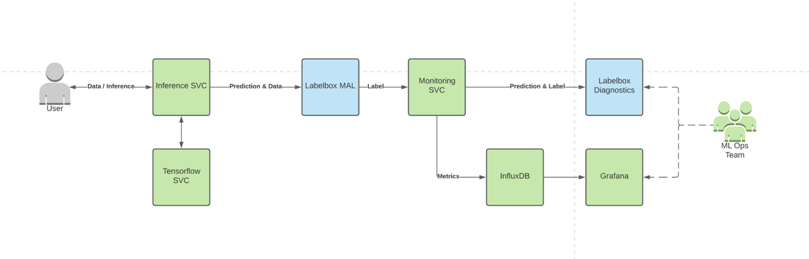

# Machine Learning Observability

  

**Labelbox** is the world’s leading training data platform for machine learning applications.

  

## Overview

Starter code for monitoring production models with Labelbox & Grafana

* This project demonstrates how to do the following:
    1. Train a neural network using data from Labelbox
    2. Deploy the trained model with instrumentation to push data to Labelbox
    3. Monitor the model performance over time using Labelbox
   
## Components

1. inference-svc
    - Service for hosting the instrumented model client
    - Routes data to labelbox
1. tensorflow-svc
    - Hosts the tfhub model
1. monitor-svc
    - Sends model inferences to Labelbox for Model Assisted Labeling
    - Once an inference is labeled a webhook sends data to this service to computes metrics
      - Metrics are then pushed to Influxdb for viewing on Grafana
      - Predictions are pushed to Model Diagnostics for viewing
1. grafana
   - Metric dashboarding tool
   - Login: admin, pass
1. influxdb
   - Timeseries metrics database used for storing data for grafana
1. storage
    - Local deployment of s3 emulator to simplify deployment

## Setup

Run the following code commands once
* `make configure-labelbox`
  - Create a config file used to parameterize the deployment (see services/monitor-svc/project_conf.json)
* `make configure-storage`
  - Creates the local storage directory structure under `./storage`
    
## Deploy

We use `docker compose` to deploy the various components. We use [Ngrok](https://ngrok.com) to make the deployment available
on your local machine to Labelbox webhooks.

Must have the following env vars set:
  - `LABELBOX_API_KEY` : [Labelbox API Key](https://docs.labelbox.com/en/introduction/faq#how-do-i-create-an-api-key-)
  - `NGROK_TOKEN` : Enables labelbox webhooks to make requests to deployments without public ip addresses 

Run `make deploy`

## Run

### Predict

Now we can send predictions to the model. See `scripts/sample_inference.py` for an example of sending predictions.

 > The first request might fail due to a timeout since we did not add warm up to the tf-server.

### Label

Predictions are sampled and uploaded to the Labelbox project created for the model. [Go to that project and begin labeling](https://app.labelbox.com/projects). 

Once an image has been labeled, **giving the label a thumbs up in review mode publish data** to `monitor-svc`.

### Observe

We use Grafana and InfluxDB for tracking and viewing metrics. If you ran this on your local machine, navigate to 
http://localhost:3005.

Navigate to http://localhost:3005/dashboard/import to import our pre-built dashboard. The pre-built dashboard can be
found under `services/grafana/dashboards/model-monitoring.json`.

